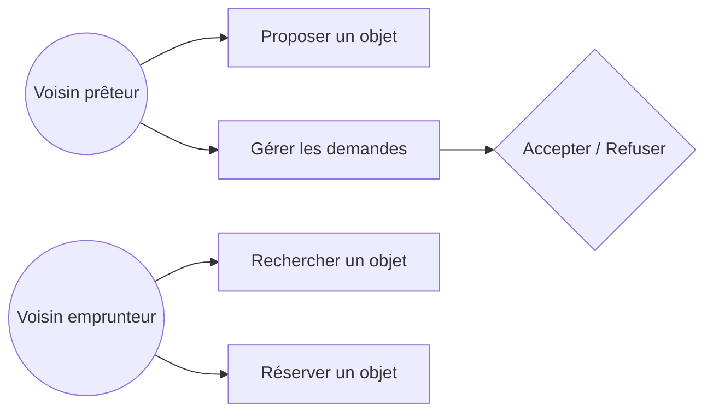
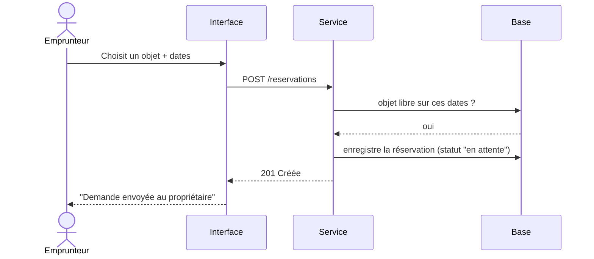

# Troc'Quartier — analyse & maquette (corrigé)

> Un exemple complet et défendable. Le tien sera différent : ce qui compte, c'est la **démarche**
> (besoin → maquette) et la présence de chaque livrable, pas les mots exacts.

## 1. Le besoin reformulé

Les habitant·es du quartier possèdent des objets peu utilisés (outils, matériel de camping,
électroménager d'appoint). **Troc'Quartier** veut un site simple qui permette à chacun·e de
**proposer** ses objets au prêt et de **réserver** ceux des autres quand ils sont libres.
Bénéfice : moins d'achats inutiles, plus de lien entre voisins. Public **non technique**, usage
**majoritairement sur mobile**.

## 2. Besoins

### Fonctionnels (ce que l'appli fait)
- Proposer un objet au prêt (nom, photo, description, durée max).
- Parcourir / rechercher les objets disponibles.
- Réserver un objet libre sur une période, et voir l'état (libre / réservé).
- Pour le propriétaire : accepter ou refuser une demande de réservation.

### Non-fonctionnels (les contraintes)
- **Accessible (RGAA)** : utilisable par une personne de 78 ans → gros libellés, contrastes, navigation clavier.
- **Responsive** : pensé mobile d'abord.
- **RGPD** : on stocke un prénom + un contact → consentement explicite, données minimisées, pas de revente.
- **Simplicité** : un parcours en 3 écrans maximum, vocabulaire courant (pas de jargon).
- **Sécurité (ANSSI)** : seul le propriétaire d'un objet peut accepter/refuser une réservation.

## 3. User stories

1. En tant que **voisin prêteur**, je veux **publier un objet avec sa photo**, afin de **le rendre visible aux autres**.
2. En tant que **voisin emprunteur**, je veux **réserver un objet libre sur des dates**, afin de **l'emprunter sans appeler personne**.
3. En tant que **propriétaire d'un objet**, je veux **accepter ou refuser une demande**, afin de **garder le contrôle sur mes affaires**.

## 4. Diagramme de cas d'usage



## 5. Wireframe — écran d'accueil (mobile)

```
┌───────────────────────────────┐
│  Troc'Quartier        ☰ menu  │
├───────────────────────────────┤
│  🔎 [ Rechercher un objet... ] │
│                               │
│  Disponibles près de chez toi │
│  ┌─────────┐  ┌─────────┐     │
│  │ 📷      │  │ 📷      │     │
│  │ Perceuse│  │ Tente   │     │
│  │ Libre ✅│  │ Réservé │     │
│  └─────────┘  └─────────┘     │
│  ┌─────────┐  ┌─────────┐     │
│  │ 📷      │  │ 📷      │     │
│  │ Raclette│  │ Échelle │     │
│  │ Libre ✅│  │ Libre ✅│     │
│  └─────────┘  └─────────┘     │
│                               │
│      [  + Proposer un objet ] │
└───────────────────────────────┘
```

> **Parcours** : Accueil (cette liste) → clic sur une carte → *Fiche objet* (détails + bouton
> « Réserver ») → *Confirmation* (dates + consentement RGPD) → retour accueil avec l'objet en « Réservé ».

## Bonus — séquence « réserver un objet »


