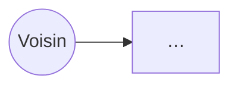

# Troc'Quartier — analyse & maquette (à remplir)

> Remplace chaque `…` par ta réponse. C'est CE document que tu présentes au jury.

## 1. Le besoin reformulé

…

## 2. Besoins

### Fonctionnels (ce que l'appli fait)
- …
- …
- …

### Non-fonctionnels (les contraintes)
- …
- …
- …

## 3. User stories

1. En tant que **…**, je veux **…**, afin de **…**.
2. En tant que **…**, je veux **…**, afin de **…**.
3. En tant que **…**, je veux **…**, afin de **…**.

## 4. Diagramme de cas d'usage



## 5. Wireframe — écran principal

```
TODO : dessine ici la disposition de l'écran d'accueil
(titre, barre de recherche, liste d'objets, bouton "Proposer un objet"…)
```
