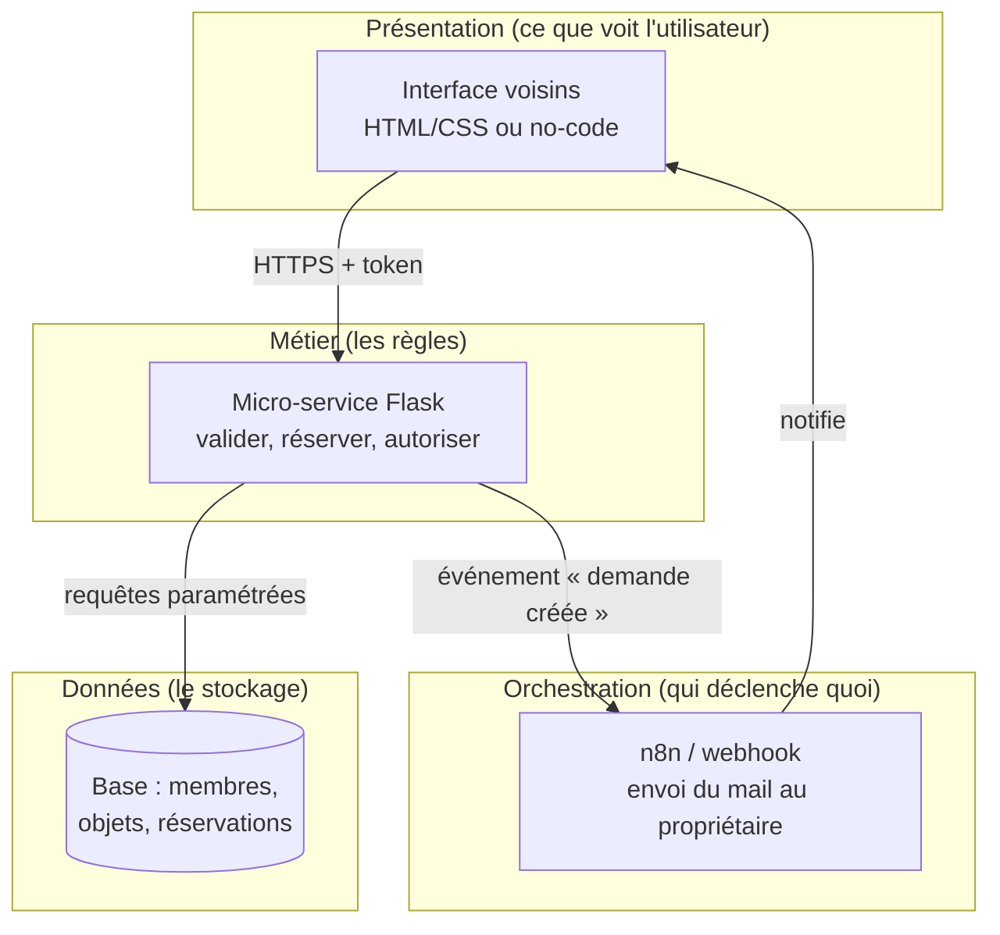
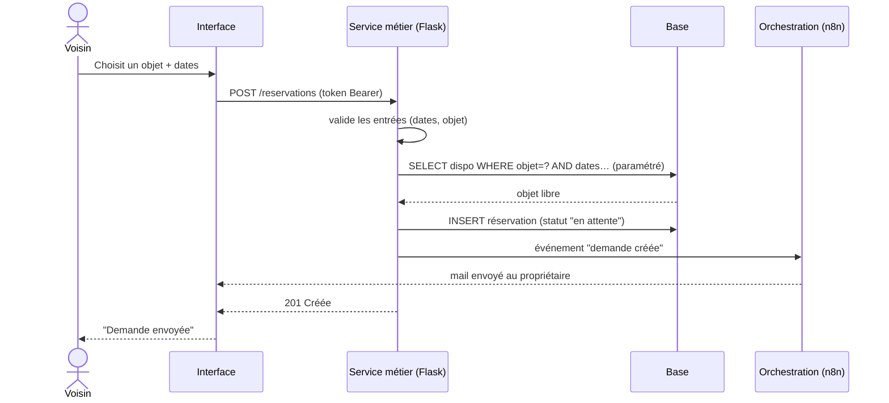

# Troc'Quartier — architecture (corrigé)

## 1. Architecture multicouche

## 2. Séquence — « un voisin réserve un objet »

## 3. Tableau des choix justifiés

| Couche | Outil choisi | Pourquoi ce choix | Point de sécurité (ANSSI) |
|---|---|---|---|
| **Présentation** | HTML/CSS (ou Lovable) | Rapide à produire, responsive, accessible (RGAA) | Ne contient **aucun** secret ; validation aussi refaite côté serveur |
| **Orchestration** | n8n (webhook + mail) | Externalise les notifications sans alourdir le métier | Pas d'accès direct à la base ; passe par l'API |
| **Métier** | Micro-service **Flask** | **Une seule source de vérité** pour les règles ; testable ; réutilisable | Validation des entrées, **token Bearer**, secrets en variables d'env |
| **Données** | SQLite → PostgreSQL | Modèle relationnel clair (membres 1-N objets/réservations) | Accès **uniquement** via requêtes **paramétrées** (anti-injection) |

## Question de défense

> **Pourquoi la règle « l'objet est-il libre ? » vit dans le micro-service et pas dans le formulaire ?**

Parce que l'interface n'est **pas fiable** : un utilisateur peut la contourner (appel direct à l'API,
requête forgée). La règle doit donc être appliquée **côté serveur**, là où on contrôle vraiment.
En la centralisant dans le micro-service, elle est : **au même endroit** (pas dupliquée), **testable**
(`pytest`), et **réutilisable** par d'autres interfaces (appli mobile demain). C'est le principe de
**séparation des responsabilités** et de **couplage faible** : si je change d'interface ou de base,
la couche métier ne bouge pas.

## Bonus — couplage faible

Remplacer SQLite par PostgreSQL ne touche **que la couche Données** (le code d'accès `db.py`).
La présentation, l'orchestration et les règles métier restent identiques : c'est exactement
ce que prouve une architecture en couches bien découpée.
