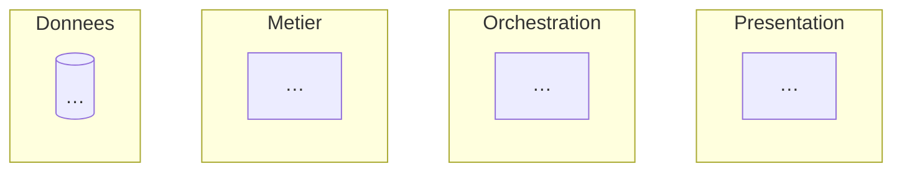
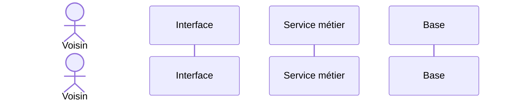

# Troc'Quartier — architecture (à remplir)

## 1. Architecture multicouche

## 2. Séquence — « un voisin réserve un objet »

## 3. Tableau des choix justifiés

| Couche | Outil choisi | Pourquoi ce choix | Point de sécurité (ANSSI) |
|---|---|---|---|
| Présentation | … | … | … |
| Orchestration | … | … | … |
| Métier | … | … | … |
| Données | … | … | … |

## Question de défense

> Pourquoi la règle « l'objet est-il libre ? » vit dans le micro-service et pas dans le formulaire ?

…
