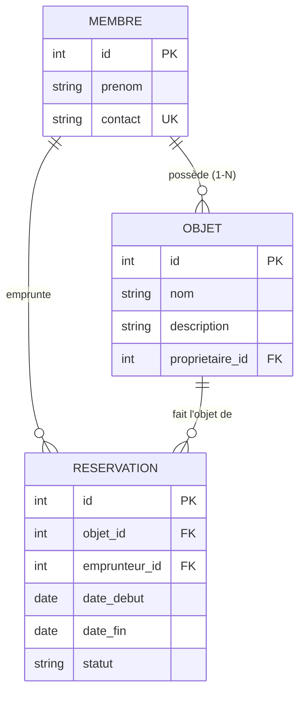

# Troc'Quartier — MCD / MLD (corrigé)

## MCD (Modèle Conceptuel des Données)

Trois entités, deux associations :

- **MEMBRE** *possède* **OBJET** — un membre possède 0..N objets ; un objet appartient à 1 membre (**1-N**).
- **MEMBRE** *réserve* **OBJET** — un membre réserve 0..N objets ; un objet est réservé 0..N fois.
  Cette association **N-N** porte des données (dates, statut) → elle devient la table `reservations`.

## MLD (Modèle Logique des Données)

- **membres** (<u>id</u>, prenom, contact*UNIQUE*)
- **objets** (<u>id</u>, nom, description, #proprietaire_id → membres)
- **reservations** (<u>id</u>, #objet_id → objets, #emprunteur_id → membres, date_debut, date_fin, statut)

> <u>souligné</u> = clé primaire · `#` = clé étrangère

## Pourquoi c'est normalisé

- Le **nom du propriétaire** n'est **pas recopié** dans `objets` : on stocke seulement `proprietaire_id`.
  Si Alice change de prénom, on le modifie **à un seul endroit** (`membres`).
- `reservations` est la **table d'association** de la relation N-N entre membres et objets : elle porte
  les attributs propres au lien (dates, statut), ce qui serait impossible à représenter sans elle.
- Chaque table a une **clé primaire** ; l'intégrité référentielle est garantie par les **clés étrangères**
  (`REFERENCES`) + `PRAGMA foreign_keys = ON`, et par les contraintes `NOT NULL` / `UNIQUE` / `CHECK`.

Le script exécutable correspondant : [`modele.py`](modele.py).
